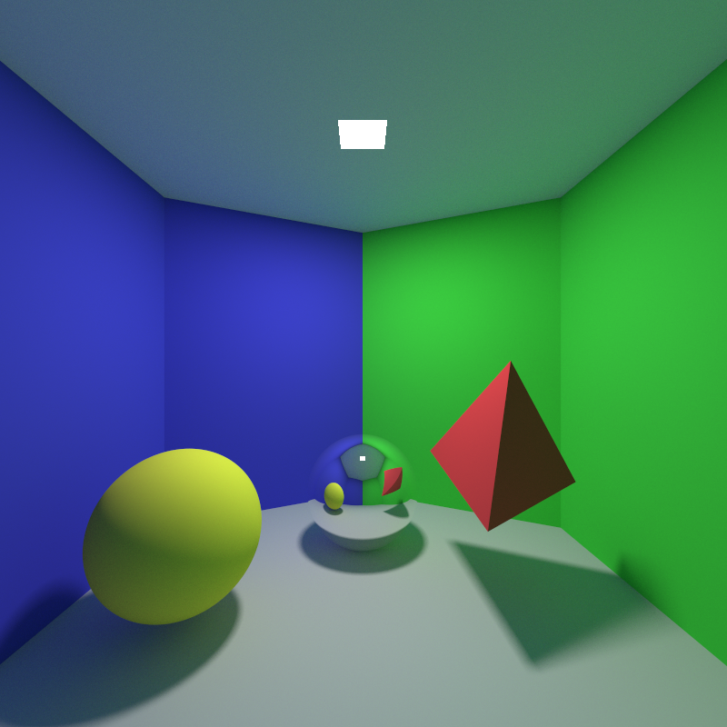

# Monte Carlo Ray Tracer

A Monte Carlo ray tracer with some flaky photon mapping.

Developed for the course *Global Illumination and Rendering* at Linköping University.

Details and more renders are available in the [report](https://raw.githubusercontent.com/veiyas/Monte-Carlo-Raytracer/master/Monte_Carlo_Ray_Tracer.pdf).
